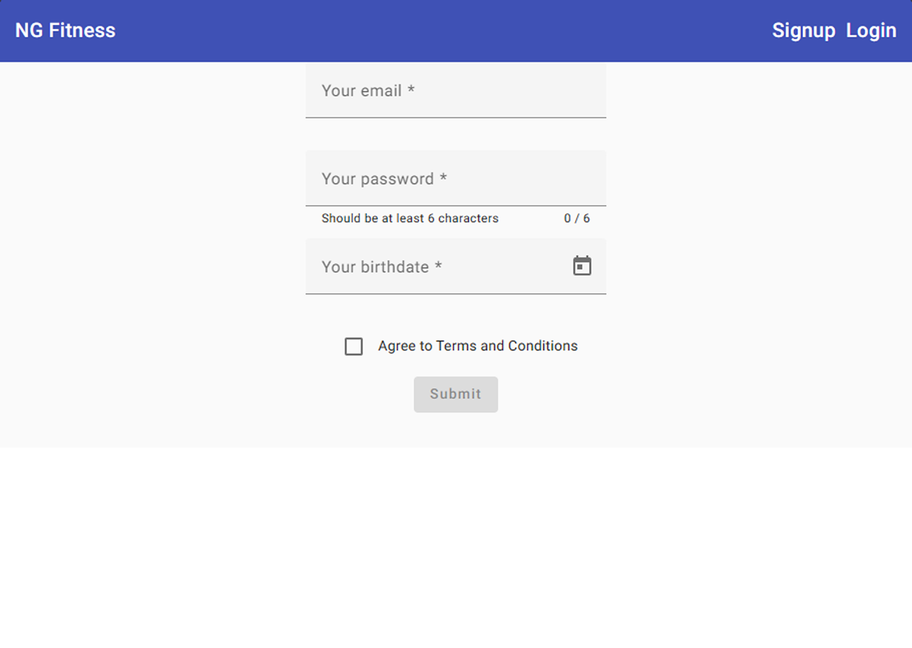

# Fitness Tracker

Originally, the scope of the project was to create an app that uses Firebase to store fitness data that can be saved through user login.
After building the base of the app, it required a significant redesign to enhance the user experience.

## Stage 1 - Build the app
**app build considerations**

## Stage 2 - Redesign
Major considerations fall on the sign up, login, and home screen pages. Animations were added to demonstate exercises to the user.
### Original Design

### Redesign
